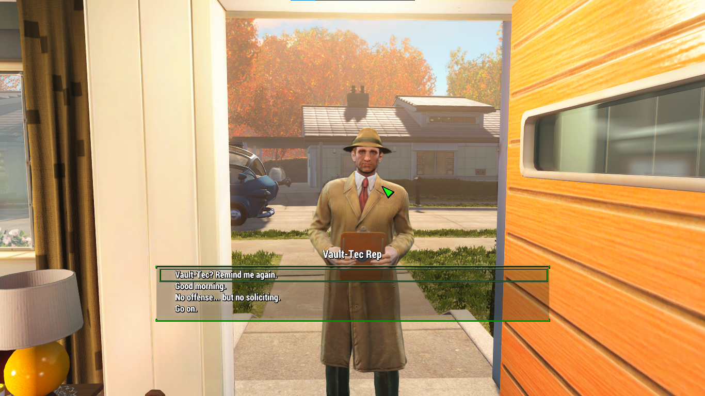
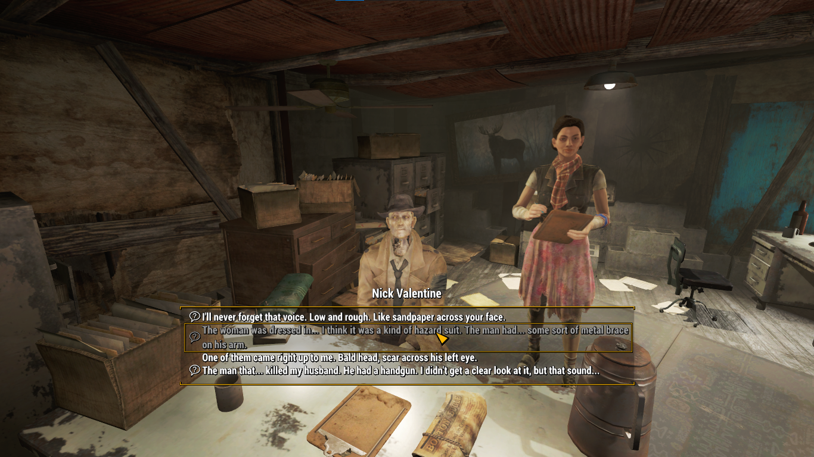
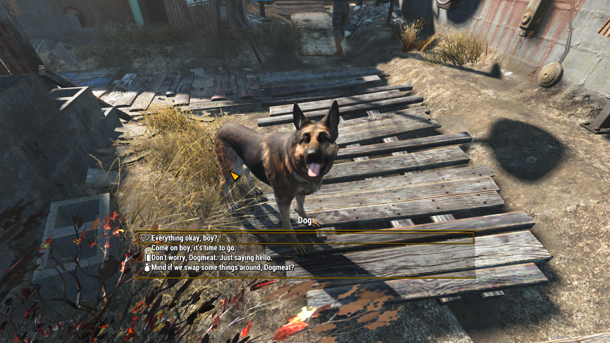
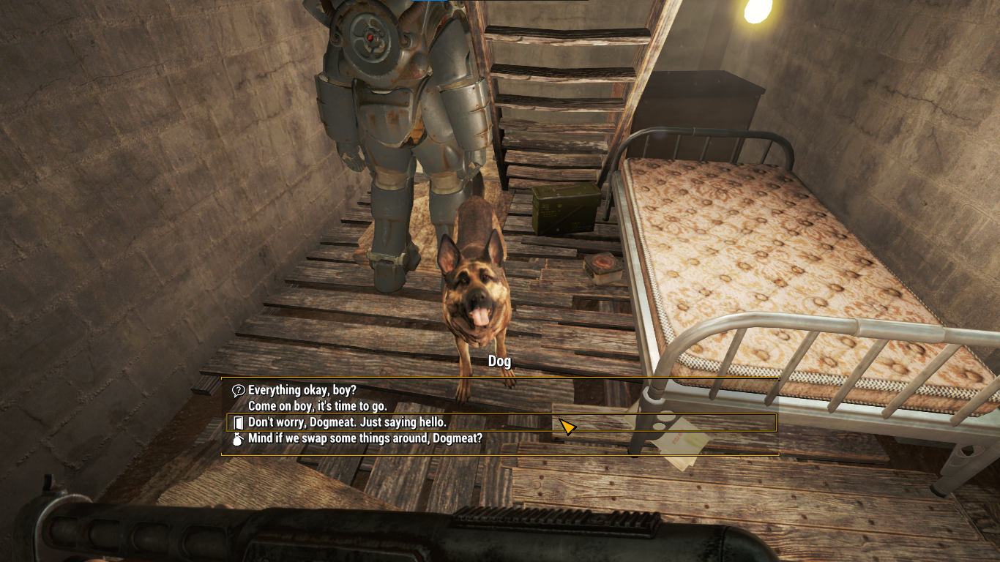
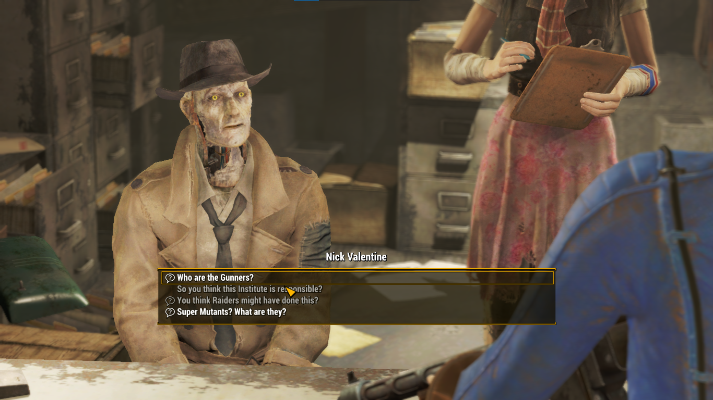
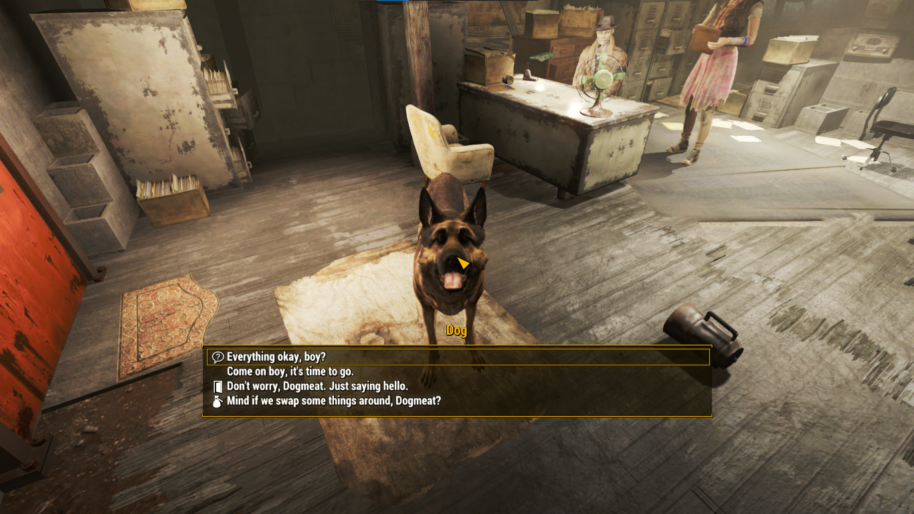
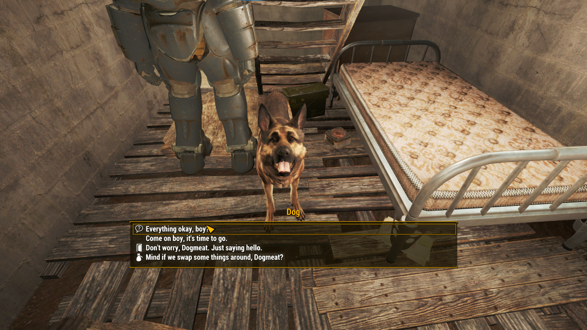
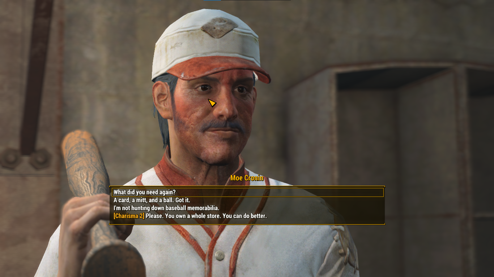

# Logs 
## Adjust font style, size, leading, letter spacing and color.

### Preview


### Changes
`Interface/DialogueMenu.swf/scripts/<default package>/DialogueListEntry.as`

1. Add the text import
```
import flash.geom.*;
import flash.text.*; //we'll be using this for the new TextFormat() var
import flash.ui.*;
```
2. Add the custom text format variable

Place this under `icon_placeholder`:
```
public var icon_placeholder:MovieClip;

private var customFormat:TextFormat;
```
3. Configure the custom text format

Add this at the end of the constructor:
```
Extensions.enabled = true;

this.customFormat = new TextFormat();
this.customFormat.font = "$MAIN_Font_Bold";
this.customFormat.size = 24;
this.customFormat.bold = true;
this.customFormat.letterSpacing = 0;
this.customFormat.leading = 4;
```
4. Apply the custom formatting and apply white color on text

After the ```showNumbers``` section:
```
if(myShared.showNumbers)
{
    GlobalFunc.SetText(this.textField,String(param1.num + 1) + ". " + param1.text,true);
}

this.textField.defaultTextFormat = this.customFormat;
this.textField.setTextFormat(this.customFormat);
this.textField.textColor = 16777215; 
```
5. Re-apply formatting after ```$$val``` replacement

The old code only replaced the text:
```
if(param1.type == 1)
{
    this.textField.text = this.textField.text.replace(/\$\$val/,"< " + String(param1.val) + " >");
}
```
New:
```
if(param1.type == 1)
{
    this.textField.text = this.textField.text.replace(/\$\$val/,"< " + String(param1.val) + " >");
    this.textField.setTextFormat(this.customFormat);
}
```
### Summary
Modified font + 24px size + bold + white text + formatting reapplied after text replacement. Everything else is unchanged.

## Adjust icon color and position.

### Preview


### Changes
`Interface/DialogueMenu.swf/scripts/<default package>/DialogueListEntry.as`

1. Icon placeholder position is no longer fixed

The old constructor had:
```
this.icon_placeholder.x = 5;
this.icon_placeholder.y = 5;
addChild(this.icon_placeholder);
```
New:
```
addChild(this.icon_placeholder);
```
So the icon is no longer locked to ```x = 5``` and ```y = 5.```

2. Text color is configurable again

The previous patch forced everything to white:
```
this.textField.textColor = 16777215;
```
New:
```
if(param1.iTextColor < 80000000)
{
    this.textField.textColor = uint(param1.iTextColor);
}
else
{
    this.textField.textColor = myShared.getColor(myShared.ct_white);
}
```
I just want to preseve and reuse the previous code tbh.

3. Icon fallback color changed

The default icon color was previously:
```
_loc5_ = myShared.ct_UI_color;
```
New:
```
_loc5_ = myShared.white;
```
This affects the default color used when no custom icon color is provided change the color to white. It matches the text color now.

4. Text height now uses the custom leading

Old:
```
textField.height = textField.textHeight + 4;
```
New:
```
textField.height = textField.textHeight + Number(this.customFormat.leading);
```
This ties the text field height to the ```leading``` value from the custom text format instead of using a hardcoded ```4```.

5. Icons are now dynamically scaled and positioned

Added after the text sizing code:
```
if(_loc4_)
{
    var scale:Number = Number(this.customFormat.size) / _loc4_.height;
    this.icon_placeholder.scaleX = scale;
    this.icon_placeholder.scaleY = scale;
    this.icon_placeholder.x = this.textField.x - this.icon_placeholder.width - Number(this.customFormat.leading);
    this.icon_placeholder.y = this.textField.y + (this.textField.height - this.icon_placeholder.height + Number(this.customFormat.leading)) / 2;
}
```
This makes the icon:

* Scale relative to the 24px text size
* Stay proportional regardless of the icon's original size
* Move automatically to the left of the dialogue text
* Vertically center itself against the text
* Use the text leading as spacing between the icon and text


### Summary
Restores custom text colors, removes the fixed icon position, and makes the icons automatically scale and align with the dialogue text.

## Fix exit and inventory icon alignment.

### Preview
Before


After


### Changes
`Interface/DialogueMenu.swf/scripts/<default package>/DialogueListEntry.as`
`Interface/DialogueMenu.swf/shapes/`

1. Icon scaling now uses the larger dimension

The previous scaling was based only on the icon height:
```
var scale:Number = Number(this.customFormat.size) / _loc4_.height;
```
New:
```
var targetSize:Number = Number(this.customFormat.size);
var scale:Number = targetSize / Math.max(_loc4_.width,_loc4_.height);
```
This prevents wide or thin icons from becoming too large. The icon is now scaled based on whichever dimension is larger.

2. Icon positioning now accounts for its actual bounds

Added:
```
var bounds:Rectangle = this.icon_placeholder.getBounds(this);
```
The icon position is then calculated using those bounds:
```
this.icon_placeholder.x = this.textField.x - targetSize - Number(this.customFormat.leading) + (targetSize - bounds.width) / 2 - (bounds.x - this.icon_placeholder.x);
this.icon_placeholder.y = this.textField.y + (this.textField.height - this.icon_placeholder.height + Number(this.customFormat.leading)) / 2;
```
This compensates for icons whose vector shapes don't occupy the same amount of space or aren't positioned consistently inside their MovieClip.

3. Vector icon shapes were tidied up

The icon vector shapes were also manually cleaned up and moved closer to the 0,0 origin as close as possible.

This reduces the amount of offset that has to be corrected in code and makes the different icons behave more consistently when they are scaled and positioned.

### Summary
fixes the sizing problem with thinner icons such as Exit and Inventory, scales based on the icon's largest dimension, uses the actual vector bounds for positioning, and cleans up the underlying icon vectors by moving their shapes closer to 0,0.

## Adjust Opacity.

### Preview


### Changes
`Interface/DialogueMenu.swf/shapes/DefineShape3(chid:28)`

Changed `DefineShape3(chid:28)` on:

`DefineShape3(chid:28)` > `shapes : SHAPEWITHSTYLE` > `fillStyles : FILLSTYLEARRAY` > `fillStyles : FILLSTYLE[]` > `fillStyle[0] : FILLSTYLE` > `color : RGBA = <cite style="color:rgb(255,255,255);">●</cite> [RGB red:255, green:255, blue:255, alpha:65]`

Old:
```
<html>color : RGBA = [RGB red:0, green:0, blue:0, alpha:40]</html>
```
New:
```
<html>color : RGBA = [RGB red:255, green:255, blue:255, alpha:65]</html>
```
The shape fill was changed from black with 40 alpha to white with 65 alpha.

### Summary
Changed the shape fill color from black to white and increased the fill alpha from 40 to 65, making the background trigger the color catcher now it got some UI color and more visible.

## Adjust NPC speaker name color.

### Preview


### Changes
`Interface/DialogueMenu.swf/scripts/<default package>/DialogueMenu.as/populateArray()`

1. Added the name_tf color transform

The new P-code adds:
```
getlocal0
getproperty QName(PackageNamespace(""),"root")
getproperty QName(PackageNamespace(""),"name_tf")
getproperty QName(PackageNamespace(""),"transform")
getlex QName(PackageNamespace(""),"myShared")
getproperty QName(PackageNamespace(""),"ct_UI_color")
setproperty QName(PackageNamespace(""),"colorTransform")
```
This gets the `name_tf` text field, accesses its `transform`, and applies `myShared.ct_UI_color` to its `colorTransform`.

2. P-code-specific note

This is a P-code-only modification to `DialogueMenu`, rather than a change to the original `.as` source code. The additional instructions are inserted into `populateArray`, immediately after the existing `name_tf.text` assignment.

The reason for making this change through P-code is that editing `DialogueMenu.as` with FFDec causes the game to crash when it attempts to open a dialogue box. Because of this, modifying the P-code directly avoids the crash while still allowing the desired color transform to be applied.

### Summary
Added `name_tf.transform.colorTransform = myShared.ct_UI_color` to make the dialogue speaker name follow the configured UI color. This version is done directly in P-code to avoid the crash encountered when modifying `DialogueMenu.as`.

## Clean up dialogue font and icon layout.
### Preview


### Changes
`Interface/DialogueMenu.swf/scripts/<default package>/DialogueListEntry.as`

1. Moved hard-coded values into constants

Font, size, leading, and padding can now be changed in one place:
```
private static const FONT_NEW_FORMAT:String = "$MAIN_Font_Bold";
private static const FONT_BOLD:Boolean = true;
private static const FONT_SIZE:Number = 24;
private static const FONT_LEADING:Number = 4;
private static const PADDING:Number = 4;
```
Instead of hard-coding them throughout the code.

2. Simplified icon placement

The icon positioning is now much cleaner. It uses `FONT_SIZE` and `PADDING` directly, with a small offset:
```
var scale:Number = FONT_SIZE / Math.max(_loc4_.width,_loc4_.height);
var iconOffset:Number = FONT_SIZE * 0.05;

this.icon_placeholder.x = this.textField.x - FONT_SIZE - PADDING - iconOffset;
this.icon_placeholder.y = this.textField.y + (this.textField.height - FONT_SIZE) / 2 + iconOffset;

_loc4_.x = (FONT_SIZE - _loc4_.width) / 2;
_loc4_.y = (FONT_SIZE - _loc4_.height) / 2;
```
This replaces the more complicated bounds-based positioning.

### Summary
Cleans up the code and makes customization easier. Font size, leading, and padding are now controlled from a few constants, and the icon positioning is simpler and easier to adjust.

## Add layout constraints and fix padding.
### Preview


### Changes
`Interface/DialogueMenu.swf/scripts/<default package>/DialogueListEntry.as`

1. Added a customizable icon spacing constraint

The icon offset is now controlled from one constant instead of being calculated directly:
```
private static const ICON_OFFSET:Number = FONT_SIZE * 0.1;
```
This makes the spacing between the icon and text easier to customize.

2. Removed empty icon placeholder indentation

When an icon is present, the text is moved to make room for the icon:
```
this.textField.x = PADDING + FONT_SIZE + PADDING;
```
When there is no icon, it starts directly at the normal padding:
```
textField.x = PADDING;
```
3. Fixed the right-side padding

The original border width is stored when the entry is created:
```
this.originalBorderWidth = this.border.width;
```
Then the border width is reduced by the padding:
```
var boxWidth:Number = this.originalBorderWidth;
border.width = boxWidth - PADDING;
```
This prevents the right side from having excessive padding after the text field is resized.

### Summary
Adds an easy-to-customize icon offset, removes the empty icon indentation, keeps the icon spacing consistent, and fixes the extra right-side padding by reducing the border width by `PADDING`.
